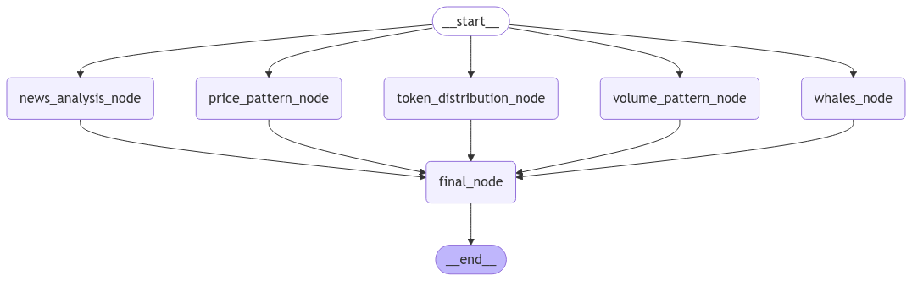
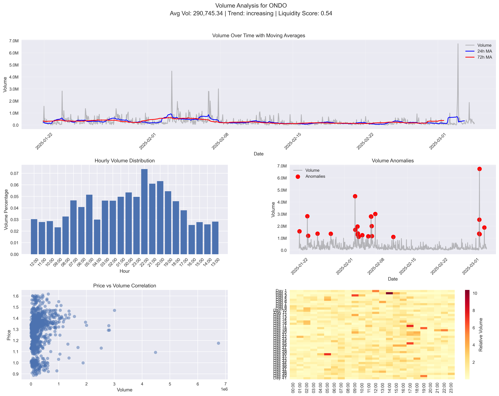
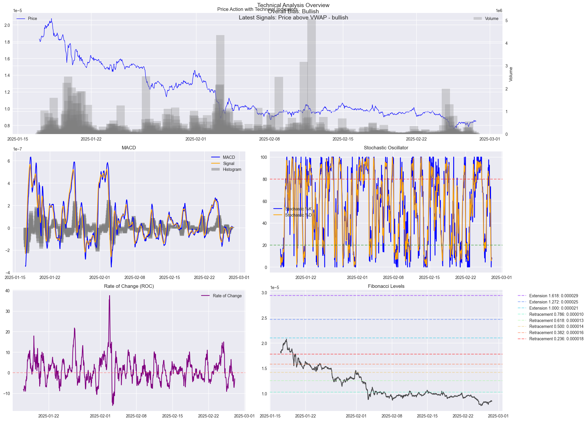

# bhorali - An Autonomous Crypto Investment Agent

### An AI Agent that given a token address does deep research on the token and returns a full analysis report for the token

    Note: Only supports Ethereum tokens for now.

### Features

1. **Whale Wallet Monitoring** ✅

2. **Token Distribution Analysis** ✅

3. **Volume Pattern Analysis** ✅

4. **Price Pattern Analysis** ✅

5. **News Analysis** ✅

6. **Risk Analysis** ✅

### Tech Stack

- Python
- Langchain
- Langgraph
- Web3.py
- OpenAI

