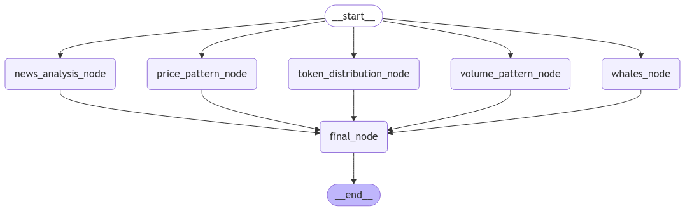
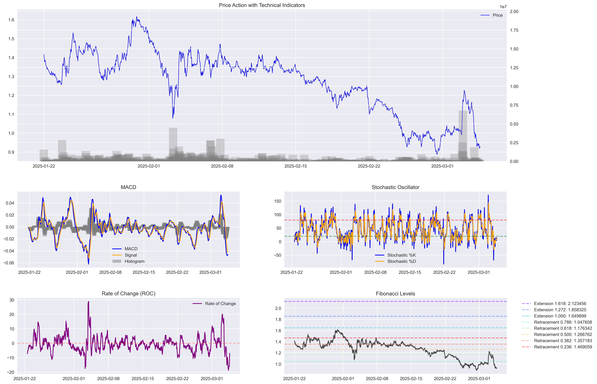
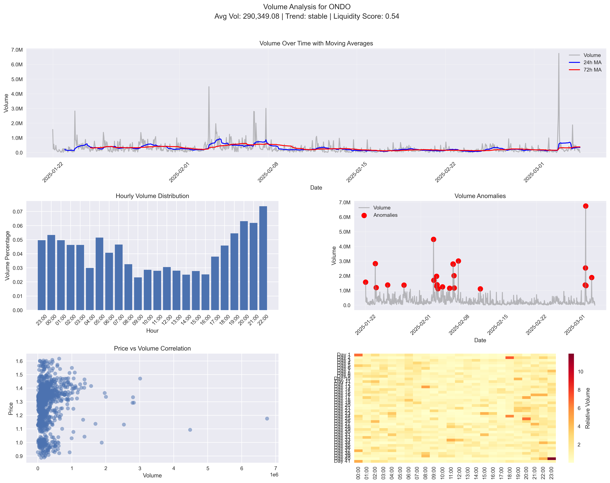

# bhorali - An Autonomous Crypto Investment Agent

### An AI Agent that given a token address does deep research on the token and returns a full analysis report for the token

    Note: Only supports Ethereum tokens for now.

### Features

1. **Whale Wallet Monitoring** ✅

2. **Token Distribution Analysis** ✅

3. **Volume Pattern Analysis** ✅

4. **Price Pattern Analysis** ✅

5. **News Analysis** ✅

6. **Risk Analysis** ✅

### Tech Stack

- Python
- Langchain
- Langgraph
- Web3.py
- OpenAI

### Example Analysis Output for ONDO Token

# Comprehensive Investment Report for ONDO Token

## Token Overview
- **Token Address:** 0xfAbA6f8e4a5E8Ab82F62fe7C39859FA577269BE3
- **Symbol:** ONDO
- **Total Supply:** 10,000,000,000 ONDO

## Technical Analysis

### Price Pattern Analysis
- **Current Price:** 0.9287
- **Bollinger Bands:**
  - **Middle Band:** 0.9917
  - **Upper Band:** 1.1309
  - **Lower Band:** 0.8526
  - **Volatility:** 0.2806

The current price is below the middle Bollinger Band, indicating a potential bearish trend. The price is closer to the lower band, suggesting it might be oversold.

### VWAP Analysis
- **Current VWAP:** 1.2929
- **Trend:** Price is below VWAP

The price being below the VWAP supports a bearish outlook, indicating that the token is trading below its average price, which could suggest selling pressure.

### Trading Signals
- **Overall Bias:** Bearish
- **Signals:** Price below VWAP

The trading signals reinforce the bearish sentiment, suggesting caution for potential investors.

### MACD (Moving Average Convergence Divergence)
- The MACD line is below the signal line, which is a bearish indicator. The histogram shows negative values, further supporting the bearish trend.

### Stochastic Oscillator
- The stochastic oscillator shows values fluctuating around the oversold region, indicating potential for a reversal, but currently supporting the bearish sentiment.

### Rate of Change (ROC)
- The ROC is negative, indicating a decline in momentum and supporting the bearish outlook.

### Fibonacci Levels
- The price is below key Fibonacci retracement levels, indicating a lack of support and potential for further decline.

### Conclusion
The technical indicators collectively suggest a bearish trend for the token. The price is below the VWAP and key Fibonacci levels, with negative momentum indicators such as MACD and ROC. The stochastic oscillator indicates potential oversold conditions, but the overall sentiment remains bearish. Investors should exercise caution and consider waiting for a confirmed reversal signal before considering entry.

## Token Distribution Analysis

### Distribution Metrics

1. **Gini Coefficient:**
   - **Value:** 0.6063
   - **Interpretation:** A relatively high level of inequality, suggesting that a significant portion of the token supply is concentrated among a few holders.

2. **Top Holder Concentration:**
   - **Top 1% Holders:** 3.90% of total supply
   - **Top 5% Holders:** 8.08% of total supply
   - **Top 10% Holders:** 10.77% of total supply
   - **Interpretation:** The concentration of tokens among the top holders is moderate. While the top 1% holds a notable portion, the distribution among the top 5% and 10% suggests a somewhat decentralized distribution, though still with significant concentration.

3. **Concentration Metrics:**
   - **Nakamoto Interpretation:** Decentralized
   - **Theil Interpretation:** Moderate inequality
   - **Interpretation:** The Nakamoto interpretation suggests that the token distribution is decentralized, which is a positive indicator for potential investors looking for a token with a broad distribution. However, the Theil interpretation of moderate inequality indicates that there is still some level of concentration that could impact market dynamics.

### Investment Potential Critique
- **Decentralization:** The token shows a reasonable level of decentralization according to the Nakamoto interpretation, which is generally favorable for investment as it reduces the risk of market manipulation by a few large holders.
- **Inequality Concerns:** The Gini coefficient and Theil interpretation highlight a moderate level of inequality in token distribution. This could pose a risk if large holders decide to sell their tokens, potentially leading to price volatility.

### Conclusion
The ONDO token presents a mixed investment potential. While the decentralization aspect is positive, the moderate inequality in distribution and concentration among top holders could pose risks. Investors should consider these factors alongside market conditions and other fundamental analyses before making investment decisions.

## Whale Activity Analysis

### Whale Activity Overview
The whale threshold is set at 100 million tokens, indicating that any address holding this amount or more is considered a whale. The analysis covers the last three days of activity.

1. **Whale Address: 0x460ae5a6666fcb9635ba99b541b31279e5966537**
   - **Current Balance:** 389,729,306.96 ONDO
   - **Percentage of Total Supply:** 3.897%
   - **Transfer Activity:**
     - Total Transfers: 21
     - Outgoing Transfers: 2
     - Incoming Transfers: 19
     - Total Outgoing Amount: 15,610,000 ONDO
     - Total Incoming Amount: 9,369,373.46 ONDO
     - **Net Flow:** -6,240,626.54 ONDO
   - **Analysis:** This whale has been actively trading, with a significant net outflow of tokens. The outgoing transfers suggest potential profit-taking or reallocation of assets. The high number of incoming transfers indicates ongoing interest in acquiring tokens, but the net outflow could signal a bearish sentiment or strategic repositioning.

2. **Whale Address: 0xa63eace47618b9677261b09b32e3ca2b5c0a0182**
   - **Current Balance:** 131,041,156.25 ONDO
   - **Percentage of Total Supply:** 1.310%
   - **Transfer Activity:**
     - Total Transfers: 73
     - Outgoing Transfers: 0
     - Incoming Transfers: 73
     - Total Outgoing Amount: 0 ONDO
     - Total Incoming Amount: 2,509,230.02 ONDO
     - **Net Flow:** +2,509,230.02 ONDO
   - **Analysis:** This whale has only incoming transfers, indicating accumulation behavior. The absence of outgoing transfers suggests a bullish outlook or a long-term holding strategy. The consistent inflow of tokens could indicate confidence in the token's future performance.

3. **Whale Address: 0x0d37bf9ef9254f73e75dcfe2da5837e22d9f3553**
   - **Current Balance:** 111,207,480 ONDO
   - **Percentage of Total Supply:** 1.112%
   - **Transfer Activity:**
     - Total Transfers: 0
     - Outgoing Transfers: 0
     - Incoming Transfers: 0
     - Total Outgoing Amount: 0 ONDO
     - Total Incoming Amount: 0 ONDO
     - **Net Flow:** 0 ONDO
   - **Analysis:** This whale has shown no transfer activity in the last three days, indicating a passive holding strategy. The lack of movement could suggest satisfaction with the current position or a wait-and-see approach.

### Conclusion
The ONDO token exhibits mixed whale activity. One whale is actively trading with a net outflow, possibly indicating a bearish sentiment or strategic repositioning. Another whale is accumulating tokens, suggesting a bullish outlook or long-term confidence in the token. The third whale remains passive, indicating a neutral stance or satisfaction with the current holdings.

## Volume Pattern Analysis

### Volume Metrics
- **Average Volume:** 290,349.08
- **Peak Volume:** 6,746,627.68
- **Minimum Volume:** 87.96
- **Volume Standard Deviation:** 402,643.32
- **Volume Stability:** -0.0879 (Low)

The high standard deviation and low volume stability indicate significant volatility in trading volumes, suggesting potential market manipulation or irregular trading activities.

### Liquidity and Market Impact
- **Liquidity Score:** 0.535 (Medium)
- **Slippage Estimate:** 0.00179
- **High Volume Slippage:** 0.00057
- **Slippage Volatility:** 3.1758
- **Price Impact Score:** 0.755

The medium liquidity score and moderate slippage estimates suggest that while the token has reasonable liquidity, large trades could still impact the market price significantly.

### Health Indicators
- **Overall Health:** High
- **Liquidity Rating:** Medium
- **Manipulation Risk:** Medium
- **Volume Stability:** Low

The overall health is rated high, but the medium manipulation risk and low volume stability are concerns for potential investors.

### Key Metrics
- **Price-Volume Correlation:** 15.4777
- **Volume Concentration:** 30.6623
- **Suspicious Patterns Count:** 87

The high price-volume correlation indicates a strong relationship between trading volume and price changes, which could be indicative of speculative trading.

### Trading Patterns
- **Peak Trading Hours:** 19:00 - 22:00, 00:00
- **Low Volume Hours:** 09:00 - 16:00

The concentration of trading activity during specific hours suggests strategic trading behavior, possibly by a few large players.

### Volume Anomalies
The chart shows several volume spikes, marked as anomalies, which could be due to large trades or coordinated trading activities. These anomalies need further investigation to understand their causes.

### Conclusion
The ONDO token presents a mixed investment potential. While it has a high overall health rating, the low volume stability, medium manipulation risk, and significant volume anomalies pose risks. Investors should be cautious and consider these factors when evaluating the token's potential. Further analysis of the suspicious patterns and trading anomalies is recommended to assess the underlying causes and potential impacts on investment.

## Token News Analysis

### Key Developments

1. **Launch of Ondo Chain:**
   - Ondo Finance has announced the launch of its native Layer 1 (L1) blockchain, Ondo Chain, which is designed specifically for institutional-grade real-world assets (RWAs).
   - Institutional support includes prominent players like BlackRock, Franklin Templeton, Wellington Management, WisdomTree, Google Cloud, ABN Amro, and Aon.

2. **Hybrid Blockchain Approach:**
   - Ondo Chain is described as a "hybrid" blockchain, combining the openness of public blockchains with the compliance and security features of permissioned chains.
   - This approach is intended to attract Wall Street investors by allowing institutions to run nodes without direct interaction with cryptocurrencies.

3. **Investment and Market Activity:**
   - World Liberty Financial, a project linked to Donald Trump, invested $470,000 in ONDO tokens following the announcement of Ondo Chain.
   - Bitcoin Suisse has added ONDO to its trading and custody offerings, indicating growing institutional interest and accessibility.

4. **Market Sentiment:**
   - There is a positive sentiment around Ondo as a leading project in the RWA space, with expectations of significant growth.
   - A crypto whale identified as “0x655” has made a notable purchase of ONDO tokens, suggesting confidence in the token's potential.

### Investment Potential Analysis

1. **Institutional Backing:**
   - The involvement of major financial institutions and tech companies provides credibility and potential for widespread adoption of Ondo Chain.
   - Institutional backing is a strong indicator of the project’s viability and potential for long-term success.

2. **Market Positioning:**
   - Ondo Finance is positioning itself as a leader in the tokenization of real-world assets, a sector that is gaining traction as traditional finance seeks to integrate with blockchain technology.
   - The hybrid blockchain model could serve as a bridge for traditional investors to enter the crypto space, potentially increasing demand for ONDO tokens.

3. **Strategic Partnerships and Adoption:**
   - Partnerships with established financial entities and the inclusion of ONDO in Bitcoin Suisse’s offerings enhance the token’s market presence and accessibility.
   - These developments could lead to increased liquidity and trading volume, positively impacting the token’s price.

4. **Market Sentiment and Speculation:**
   - Positive market sentiment and speculative interest, as evidenced by significant investments from entities like World Liberty Financial and crypto whales, suggest potential for price appreciation.
   - However, investors should be cautious of speculative bubbles and ensure due diligence.

### Risks and Considerations
- **Regulatory Risks:** As Ondo Chain targets institutional investors, it must navigate complex regulatory environments, which could impact its operations and adoption.
- **Market Volatility:** The crypto market is inherently volatile, and while institutional interest provides stability, external market factors could affect ONDO’s price.
- **Execution Risks:** The success of Ondo Chain depends on its ability to deliver on its promises and effectively integrate with traditional finance systems.

### Conclusion
Ondo presents a promising investment opportunity, particularly for those interested in the intersection of traditional finance and blockchain technology. The strong institutional backing, innovative hybrid blockchain approach, and positive market sentiment position Ondo as a potential leader in the RWA space. However, investors should remain aware of the associated risks and conduct thorough due diligence before investing.

## Trading Recommendations

### Entry Strategy
Given the current bearish technical indicators, potential investors should consider waiting for a confirmed reversal signal before entering. Monitoring the stochastic oscillator for signs of oversold conditions reversing could provide a more favorable entry point.

### Exit Strategy
For those currently holding ONDO, it may be prudent to set stop-loss orders below key support levels identified by Fibonacci retracement to mitigate potential losses. Additionally, monitoring whale activity for signs of large sell-offs could inform timely exits.

## Professional Opinion
The ONDO token presents a complex investment landscape with both promising opportunities and significant risks. The strong institutional backing and innovative approach to integrating traditional finance with blockchain technology are compelling. However, the current bearish technical indicators, moderate inequality in token distribution, and potential for market manipulation warrant a cautious approach. Investors should conduct thorough due diligence and consider both technical and fundamental factors before making investment decisions.

**Disclaimer: This report is for informational purposes only and should not be considered financial advice. Investors should consult with a financial advisor before making any investment decisions.**